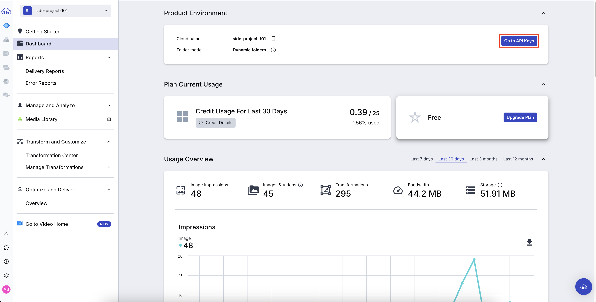
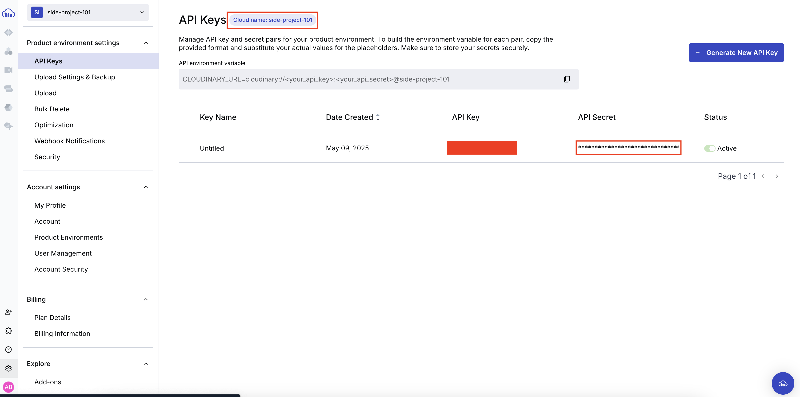
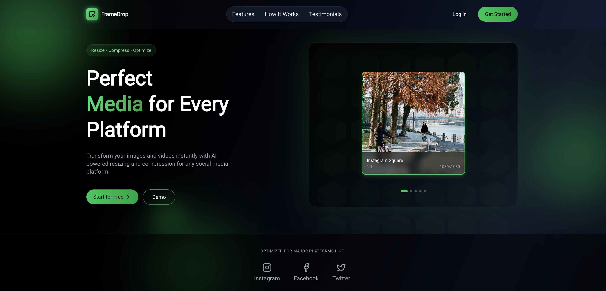
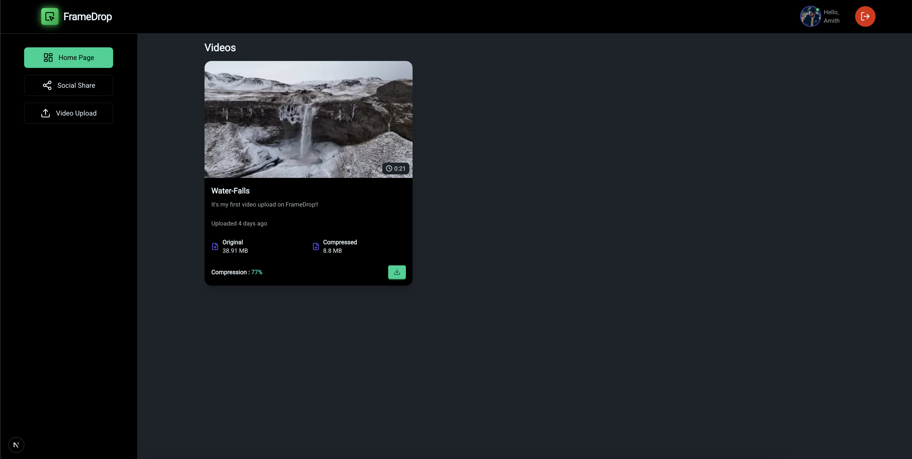
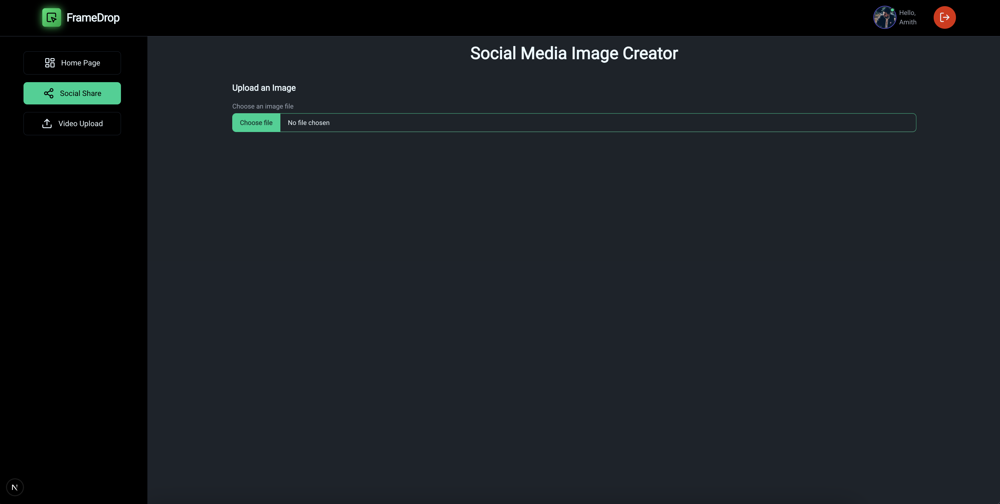
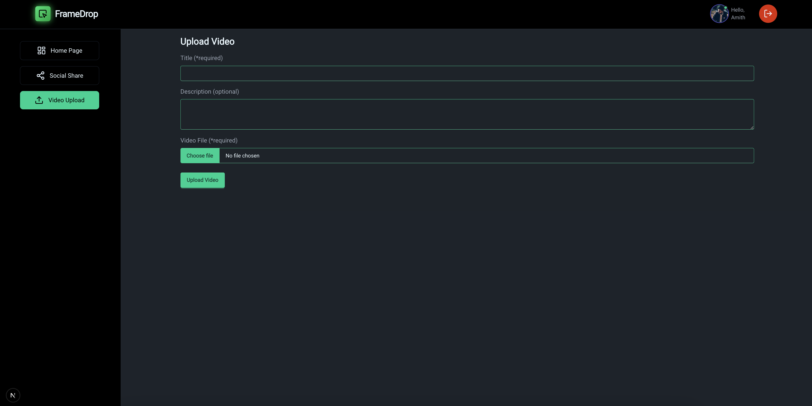

<div align="center"> 
    <h1>FrameDrop</h1>
</div>

<div align="center"> 
     
    <h3>
        <ins>Image resizer and Video compressor!</ins>
    <h3>
</div>

<div align="center"> 

[](https://www.youtube.com/watch?v=n08fQqqWhuY)

</div>

FrameDrop is a modern media utility web application that allows users to effortlessly adjust image aspect ratios for various social media platforms and compress video files for optimal web usage. Built using **Next.js**, **TailwindCSS (with DaisyUI)**, **Cloudinary**, and **Clerk** for authentication.

##

### ✨ Features

- 🔒 Secure authentication with [Clerk](https://clerk.dev)
- 📐 Adjust image aspect ratios (Instagram, Twitter, YouTube, etc.)
- 🎞️ Compress videos size.
- ☁️ Imge and Video upload process happens via [Cloudinary](https://cloudinary.com)
- 🎨 Sleek UI with [TailwindCSS](https://tailwindcss.com) and [DaisyUI](https://daisyui.com)
- ⚡ Fast and SEO-friendly performance with [Next.js](https://nextjs.org)

##

### 🚀 Tech Stack

- **Frontend:** Next.js, TailwindCSS, DaisyUI
- **Authentication:** Clerk
- **Media Management:** Cloudinary
- **Cloudinary-next** : For optimized Image and Video Component 
- **Database** : NeonDB(Postgres)
- **ORM** : Prisma
- **Other Libraries** : dayjs, filesize, lucid-react and react-toastify

##

### 🖼️ Image Aspect Ratio Presets

| Platform    | Aspect Ratio |
|-------------|--------------|
| Instagram Post | 1:1 |
| Instagram Story | 9:16 |
| Twitter | 16:9 |
| YouTube Thumbnail | 16:9 |
| LinkedIn | 1.91:1 |

##

### 📦 Getting Started

#### 1. Clone the repository :

```bash
git clone https://github.com/your-username/framedrop.git
cd framedrop
```

#### 2. Install dependencies :

```bash
npm install
# or
yarn install
```

#### 3. Setup Environment Variables : Create a  `.env` file and add the following :

```bash
# Clerk API Keys :
NEXT_PUBLIC_CLERK_PUBLISHABLE_KEY="your_clerk_publishable_key"
CLERK_SECRET_KEY="your_clerk_secret_key"

NEXT_PUBLIC_CLERK_SIGN_IN_URL="/sign-in"
NEXT_PUBLIC_CLERK_SIGN_UP_URL="/sign-up"

# Database URL :
DATABASE_URL="NeonDB_URL"

# Cloudinary API Keys :
NEXT_PUBLIC_CLOUDINARY_CLOUD_NAME="your_cloud_name"
CLOUDINARY_API_KEY="your_cloudinary_api_key"
CLOUDINARY_API_SECRET="your_cloudinary_api_secret"
```

**NOTE** :

- Refer [CLERK GUIDE](CLERK.md) file for setting up Clerk Authentication and retrieving the API keys.

- Refer [NEONDB GUIDE](NEONDB.md) file for setting up NeonDB postgreSQL and retrieving the connection string(Don't choose the connection pool string).

- Create an account on [Cloudinary](https://cloudinary.com/) and Get the API Keys from the dashbord.

    

    

#### 4. Run the development server :

```bash
npm run dev
# or
yarn dev
```

Visit http://localhost:3000 to see the app in action.

##

### 🧠 Project Structure

```graphql
.
├── components/      # Reusable UI components
├── lib/             # Cloudinary utils and helper functions
├── pages/           # Next.js routes
├── public/          # Static files
├── styles/          # Global CSS and Tailwind config
├── utils/           # Utility functions
└── ...
```

##

### 🛠️ To-Do / Improvements

- Image format converter.

- Image background removal.

##

### 📸 Screenshots

<div align="center"> 
     
</div>

<div align="center"> 
    
</div>

<div align="center"> 
    
</div>

<div align="center"> 
    
</div>

##

<div align="center"> 
    <p style="font-size: 25px; font-weight: 900">🧑‍💻 Author</p>
    <p>Made with ❤️ by Amith</p>
</div>